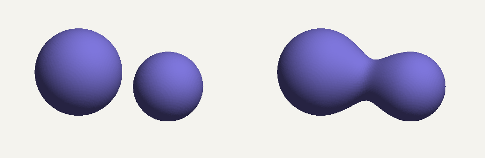
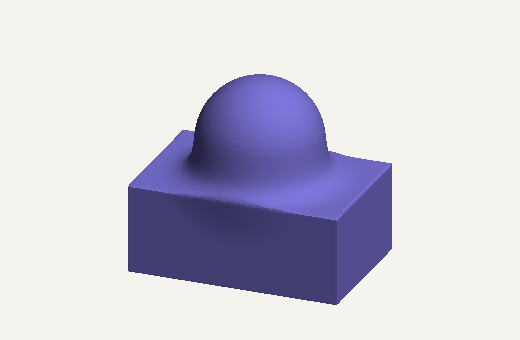

# Goop

A signed distance field (SDF) modelling library. The geometry core is C++17 and
exposes a C ABI, which a C# library wraps for .NET Framework 4.8, .NET 8 and
.NET 10. You build shapes from primitives, combine them with CSG and smooth
blends, mesh the result into triangles, and export it as STL.

```csharp
using var blob = Sdf.Sphere(1.0)
                    .SmoothUnion(Sdf.Sphere(0.8).Translate(2.0, 0, 0), 1.2);

using var mesh = blob.ToMesh(new Vec3(-1.5, -1.5, -1.5), new Vec3(3.2, 1.5, 1.5),
                             resolution: 128,
                             progress: p => Console.Write($"\r{p:P0}"));

mesh.SaveStl("blob.stl");
```





Windows x64 only for now. See [limitations](docs/design.md#limitations-and-future-work).

## Features

- **Shapes:** sphere and box, combined with union, intersection, subtraction and smooth union, and moved with translation.
- **Evaluation:** the distance at one point, or at a batch of points in a single native call.
- **Meshing:** surface nets, with progress reporting and cancellation. Meshes are closed and consistently wound.
- **Export:** binary STL.
- **Interop:** a documented C ABI with reference-counted handles, `SafeHandle` ownership on the .NET side, exception-safe callbacks, and an ABI version check on first use.
- **Packaging:** one NuGet package that carries the native DLL for all three target frameworks, tested by a project that installs the packed `.nupkg`.

## Quick start

Requires Windows x64, Visual Studio 2022 or later with the C++ workload, the
.NET 10 SDK, and the .NET Framework 4.8 Developer Pack.

```powershell
.\scripts\build.ps1                                     # build, test, pack
dotnet run --project dotnet\samples\Goop.Gallery        # writes STL files to gallery\output
```

## Documentation

- **[How SDFs work](docs/sdf.md):** distance functions, CSG with `min` and `max`, smooth union, and meshing.
- **[Building and testing](docs/building.md):** prerequisites, build steps, and debugging across the C# / C++ boundary.
- **[Design notes](docs/design.md):** architecture, ABI rules, ownership, errors, callbacks, threading, packaging, testing, and limitations.

## License

[MIT](LICENSE).
