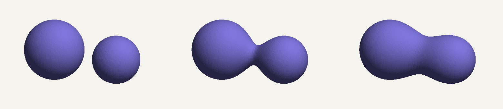

# Goop

*Sculpt shapes that melt into each other, then print them.*

A small signed-distance-field kernel: a C++17 core behind a stable C ABI,
driven from C# through a fluent API on .NET Framework 4.8, .NET 8 and .NET 10.
Shapes are combined with CSG and smooth blends, meshed with surface nets, and
exported as STL.

```csharp
using var blob = Sdf.Sphere(1.0)
                    .SmoothUnion(Sdf.Sphere(0.8).Translate(2.0, 0, 0), 1.2);

using var mesh = blob.ToMesh(new Vec3(-1.5, -1.5, -1.5), new Vec3(3.2, 1.5, 1.5),
                             resolution: 128,
                             progress: p => Console.Write($"\r{p:P0}"));

mesh.SaveStl("blob.stl");
```


**Status:** experimental. The whole pipeline works end to end on Windows x64;
the shape vocabulary is still small. See [what's in](#features) and
[what's not](#not-yet-implemented).

## What is an SDF?

A **signed distance field** is a function that takes a point in space and returns
the distance to the nearest surface of a shape — *negative* inside the shape,
*zero* exactly on the surface, *positive* outside. A unit sphere at the origin is
just `length(p) - 1`. That is the whole representation: no vertices, no faces,
just a function you can ask about any point.

The reason this is worth doing is that shapes composed this way combine
trivially. The union of two shapes is the `min` of their two distances; the
intersection is the `max`; subtracting one from the other is `max(a, -b)`. Solid
modelling that would be fiddly with triangle meshes becomes three lines of
arithmetic.

And because those combinations are just arithmetic, they can be *softened*. A
plain `min` leaves a sharp crease where two surfaces meet. Replace it with a
smooth interpolation between the two distances and the surfaces bulge into one
another instead — the blend radius `k` controls how far the influence reaches. At
`k = 0` you get an ordinary union; turn it up and the shapes melt together like
two drops of water touching. That effect is what this project is named after, and
it is the reason to build an SDF kernel rather than a mesh library.

The distance functions and smooth-blend formulae used here come from **Inigo
Quilez's** public articles on distance functions, which are the standard
reference for this material: <https://iquilezles.org/articles/distfunctions/>
(see also his article on smooth minimum functions) — the background for anything
in `native/src/shape.cpp`.

## Prerequisites

| Requirement | Notes |
|---|---|
| **Visual Studio 2022 or later** | With the **Desktop development with C++** workload. The generator is detected by CMake, not hardcoded, so any recent version works. |
| **CMake 3.20+** | Either installed standalone and on `PATH`, or the **C++ CMake tools for Windows** component inside Visual Studio — `scripts/build.ps1` finds either. |
| **.NET SDK 10** | Builds all three target frameworks. The `net8.0` reference pack and runtime must also be present (they ship with the 8.0 runtime install). |
| **.NET Framework 4.8 Developer Pack** | Required to *build* the `net48` target — the runtime alone is not enough, MSBuild needs the reference assemblies. <https://dotnet.microsoft.com/download/dotnet-framework/net48> |
| **Windows, x64** | The only supported configuration. `goop_native.dll` is 64-bit and every managed project is pinned to x64 so it can load. |
| **.NET Framework 4.8 targeting pack** | Included with the Developer Pack above. |

## Build

One command does everything — configure, build, both test suites, all three
target frameworks, then packs the NuGet package and tests it the way an outside
project would consume it:

```powershell
.\scripts\build.ps1
```

```powershell
.\scripts\build.ps1 -Configuration Release
.\scripts\build.ps1 -SkipTests
```

The same thing by hand, if you want to see the pieces:

```powershell
# native: configure, build, test
cmake --preset windows-x64
cmake --build --preset debug
ctest --preset debug

# managed: build and test net48, net8.0 and net10.0
dotnet build dotnet\Goop.sln --configuration Debug
dotnet test  dotnet\Goop.sln --configuration Debug --settings dotnet\goop.runsettings

# package: pack to artifacts\packages, then consume it from a separate project
dotnet pack dotnet\src\Goop\Goop.csproj --configuration Debug
dotnet test dotnet\tests\Goop.PackageTests --configuration Debug --settings dotnet\goop.runsettings
```

`Goop.PackageTests` is deliberately **not** in `Goop.sln`: it references Goop only
as a package, which does not exist until `dotnet pack` has run.

Formatting:

```powershell
.\scripts\format.ps1          # rewrite native sources
.\scripts\format.ps1 -Check   # report drift, non-zero exit
```

`goop_native.dll` lands at `build/bin/<Config>/goop_native.dll`. The test and
sample projects copy it next to their own output automatically. The OS loader
resolves `goop_native.dll` from the running executable's directory, and CMake's
output is outside the MSBuild graph, so the copy has to be explicit.

Run the sample:

```powershell
dotnet run --project dotnet\samples\Goop.Gallery --framework net10.0
```

### Debugging across the boundary

Stepping from C# into C++ needs the native debug engine loaded alongside the
managed one.

- **Gallery** — already configured. `dotnet/samples/Goop.Gallery/Properties/launchSettings.json`
  sets `nativeDebugging: true`, so a breakpoint in `native/src/api.cpp` binds and
  F11 at a P/Invoke call site steps into C++.
- **Tests** — VSTest owns its host process, so this is a Visual Studio setting:
  **Test > Options > Enable native code debugging**. Turn it off afterwards; it
  slows every run.
- Open `build/goop.slnx` for native work (CMake generates it) and
  `dotnet/Goop.sln` for managed.

Both rely on `goop_native.pdb` sitting next to `goop_native.dll`, which the copy
target handles.

## Architecture

```
  Gallery / consumer app
           |
           v
  Goop  (C#, fluent API)          Sdf.Sphere(...).SmoothUnion(...).ToMesh(...)
           |                      Shape / Mesh / Vec3 / StlWriter
           |  P/Invoke            SafeHandles, blittable structs, pinned buffers
           v
  goop.h  (C ABI)                 extern "C", opaque handles, status codes
           |                      goop_shape / goop_mesh / goop_vec3
           v
  C++17 core                      SDF node graph  ->  surface-nets mesher
                                  (shape.cpp)         (mesher.cpp)
```

Each arrow is a boundary with its own rules. The one that matters most is the
third: everything above it may be C#, everything below it may be C++, and the
line itself is C and nothing but C. `native/include/goop/goop.h` spells out those
rules, and `native/src/api.cpp` is the only file allowed to cross them.

The static/shared split in `native/CMakeLists.txt` follows from that: the C++
core is a static library so the Catch2 tests can link it and use real C++ types,
while the C ABI is tested from C# — because the only honest test of an ABI is a
foreign caller.

## Features

- **Shapes:** sphere.
- **Operations:** union, intersection, subtraction, smooth union (polynomial smooth minimum), translation.
- **Evaluation:** single point, or a whole batch of points in one native call.
- **Meshing:** surface nets over a regular grid, with progress reporting and cancellation. Output is watertight and consistently wound (counter-clockwise from outside).
- **Export:** binary STL.
- **Interop:** a narrow C ABI (`goop.h`) with opaque, reference-counted handles, caller-allocated buffers and status codes; `SafeHandle` ownership, pinned-span batch calls and exception-safe callbacks on the C# side.
- **Packaging:** a single NuGet package carrying the native DLL for all three target frameworks, verified by a test project that consumes the packed `.nupkg`.

Design decisions and their reasoning are in [docs/design.md](docs/design.md).

## Not yet implemented

- More primitives: box, torus, cylinder.
- More transforms: rotation, uniform scale, twist.
- Automatic bounds: `ToMesh` currently needs the caller to supply a box that contains the shape.
- Sharper meshing: dual contouring's per-cell least-squares vertex placement (the "QEF"), so CSG edges stay crisp instead of bevelled.
- Sparse sampling: every grid sample is evaluated today; a narrow band or octree around the surface would make high resolutions affordable.
- A load-time check that `Goop.dll` and `goop_native.dll` agree on `GOOP_ABI_VERSION`.
- Platforms other than Windows x64.

## Gallery

The same two spheres, first combined with a plain union, then with a smooth union:


The blend radius `k` controls how far the melt reaches. Below a threshold set by
the gap between the surfaces the spheres stay apart; above it they join, and the
neck thickens as `k` grows:



Regenerate the meshes with `dotnet run --project dotnet\samples\Goop.Gallery`; the
STL files land in `gallery/output/`.
